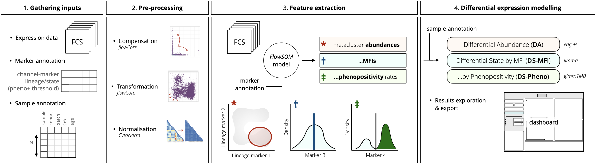
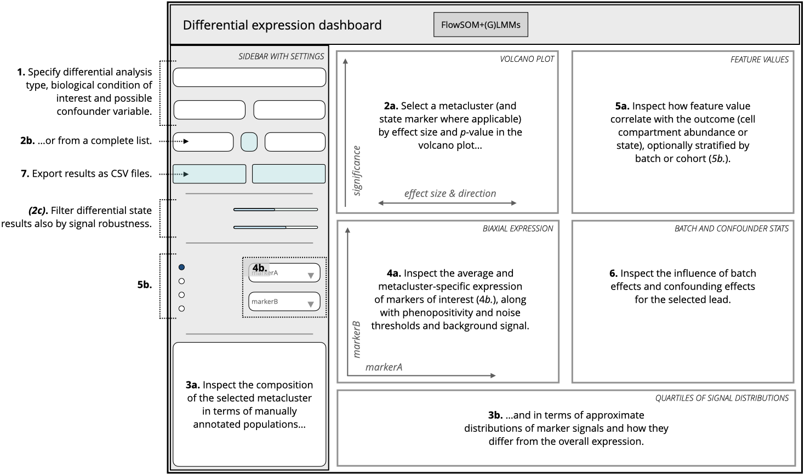
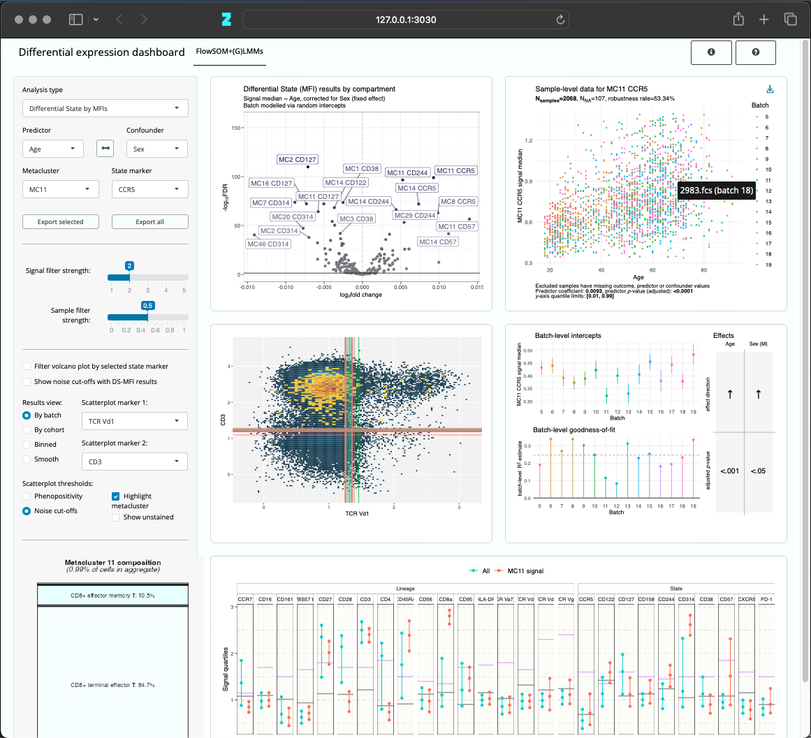

## `iidx`: interactive & interpretable differential expression models

**`iidx` is a fully documented workflow for interactive and interpretable differential expression (DE) modelling in cytometry.**
Written in R, `iidx` extends state-of-the-art tools for pre-processing, feature extraction and statistical analysis of flow and mass cytometry data, and includes **a novel framework for post-hoc filtering, interpretation and export of results**.
It can be used as a reference and basis for other computational analyses of large cytometry datasets.

We have validated our pipeline in two analyses of age- and sex-associated immunophenotype changes across 2089 donors, focusing on B-cell and T- & NK-cell flow data from peripheral blood, measured in 15 batches.



**Overview of the computational pipeline.** **1.** *FCS inputs and associated metadata are gathered.* **2.** *Data is pre-processed to obtain clean protein expression signal with minimal amount of batch effect.* **3.** *A clustering model is trained to partition data into subsets and extract salient features per subset, sample and marker.* **4.** *A battery of adapted parametric tests is used to model differential abundance and state of cell subsets based on sample-level biological predictors.*

<details>
<summary><b>Differential expression modelling background</b>: investigating changes in phenotype by condition 👩‍🔬</summary>

DE modelling is a standard approach to the exploration of multi-sample cohorts of cytometry and other single-cell data.
The task is to **model phenotype changes in patient or donor samples in association with biological correlates**, such as age, sex, diagnosis or serostatus.
Over the past decade, a number of semi-supervised computational approaches have emerged in this field as important drivers of biological discovery.

Some important tools include

* [**FlowSOM**](https://pubmed.ncbi.nlm.nih.gov/34172973/): for clustering, feature extraction and both parametric and non-parametric tests of group differences (primarily for cytometry data, broadly applicable in single-cell).
* [**cydar**](https://pubmed.ncbi.nlm.nih.gov/28504682/): for identification  of differentially abundant populations between groups of mass cytometry samples.
* [**CellCnn**](https://www.nature.com/articles/ncomms14825): for supervised representation learning of rare phenotypes associated with disease (validated with cytometry data, broadly applicable in single-cell).
* [**diffcyt**](https://www.nature.com/articles/s42003-019-0415-5): for comprehensive differential abundance and state modelling with custom experimental designs (adapting scRNA-seq tools to cytometry).
* [**CytoGLMM**](https://bmcbioinformatics.biomedcentral.com/articles/10.1186/s12859-021-04067-x): for comparing protein expression in a chosen cell type using more specific statistical models to account for marker correlations (in cytometry data).

<hr>
</details>
<details>
<summary><b>Outstanding challenges</b> that `iidx` addresses 🗝️</summary>

There are some challenges in DE modelling, pertaining both to **methodology and usability**, that complicate this type of analyses.
We describe these challenges and how we tackle them below.

#### <u>Batch effect</u>

Variability in reagent lots, imperfect instrument calibration or inconsistencies in sample storage make **technical variation between batches of samples** particularly common in flow and mass cytometry experiments.
This variance manifests itself in the form of different signal distributions per channel across sample groups, and the effects can differ across distinct cell compartments.

Unwanted technical variability of this sort can both drive spurious associations and mask existing biological variability.
**This can invalidate clustering, feature extraction and DE modelling solutions.**

Batch effect can be reduced via **signal normalisation** (*e.g.*, using simple quantile normalisation or more elaborate tools such as *cyCombine* or *CytoNorm*) and/or adjusted for by using multivariate or random-effect **batch-aware statistical models**.

`iidx` includes both steps, as well as **novel implementations of post-hoc testing** to determine robustness of effects with respect to batches, and how different batches contribute.

#### <u>Sampling biases and confounding effects</u>

In addition to technical batch effects, the **combined influence of multiple biological correlates** can lead to misinterpretation.
This can happen due to sampling bias: a common example is when a sample cohort is age- or sex-imbalanced.
However, true confounding effects can also contribute to this problem.

`iidx` tackles this by fitting multivariate models where applicable, and comparing the magnitude and significance of each concurrent effect.
**This serves to disentangle different trends.**

#### <u>Unreliable *p*-values at large sample sizes</u>

When fitting statistical models to data with large sample counts, **even spurious effects may yield low *p*-values** which persist after multiple testing correction.
This makes filtering results difficult.

`iidx` avoids pre-set bounds for *p*-values or effect sizes, instead providing an interace to explore of results in full, using model coefficients for intial sorting.
Additionally, filtering by signal robustness can be applied to results (described below).

#### <u>Noise due to background signal</u>

Detection of cell-level protein expression in cytometry is complicated by autofluorescence, signal spillover remaining after compensation or other types of technical noise.
This affects the **signal-to-noise ratios** specific to any given experimental set-up.

`iidx` can incorporate data from **unstained samples** (without any signal from fluorophore/isotope-conjugated antibodies) to **empirically determine levels of background signal per channel**.
Subsequently, results in any given cell compartment can be **filtered by robustness to noise**, evaluating whether the signal exceeds adaptively set noise cut-offs.

#### <u>Effective collaboration and interpretability</u>

**In practice, analyses with large amounts of results or complex experimental designs require many re-runs, tuning of input parameters and careful interpretation.**
We recognised this as a key challenge in our large DE analyses.

More often than not, **the expertise of a computational analyst** (data scientist, statistician or bioinformatician) **and a domain expert** (biologist) **must be combined** for a successful analysis.

It is crucial to explore results in a comprehensive way, where **biologically relevant leads can be identified by the domain expert**, without heavy-handed curation by the computational analyst.
In our experience, this is a non-trivial task.

`iidx` facilitates this by providing a **highly customisable end-to-end pipeline**, as well as a **novel interactive dashboard** which allows the domain expert to explore data in full and export results of interest.

</details>

## Installing

`iidx` was tested with R version 4.3.3 and RStudio version 2024.09.1+394.
We provide R code to install required packages below.
Once all of them are installed, clone this repository, create a new project (`.Rproj`) in the downloaded directory and make sure it is set as the working directory within the active R session.

<details>
<summary><b><u>Installing dependencies</u></b></summary>

```R
## For browsing results of finished analysis:

install.packages('devtools')
library(devtools) # to install from GitHub

install.packages('tidyverse')
install_github('saeyslab/FlowSOM')
install.packages('gridExtra')
install.packages('ggrepel')
install.packages('ggExtra')
install.packages('shiny')
install.packages('shinythemes')
install.packages('shinyjs')
install.packages('ggiraph')
install_github('exaexa/scattermore')
install.packages('bslib')
install.packages('shinycssloaders')
install.packages('shinyBS')
install.packages('bsplus')
install.packages('ggh4x')
install.packages('shinyWidgets')
install.packages('htmltools')

## Additionally, for running entire analysis:

install_github('RGLab/flowCore')
install_github('RGLab/flowWorkspace')

install_github('RGLab/CytoML')
# ^ if installing on a Mac, see https://github.com/RGLab/CytoML/issues/154

install_github('saeyslab/CytoNorm')
install.packages('umap')
install_github('raivokolde/pheatmap')
```

<hr>
</details>
<details>
<summary><b>Session info</b> for reproducibility</summary>

For reproducibility, this is the output of `sessionInfo()` on a machine where the analysis runs successfully:

```R
R version 4.3.3 (2024-02-29)
Platform: aarch64-apple-darwin20 (64-bit)
Running under: macOS Sonoma 14.1.1

Matrix products: default
BLAS:   /System/Library/Frameworks/Accelerate.framework/Versions/A/Frameworks/vecLib.framework/Versions/A/libBLAS.dylib 
LAPACK: /Library/Frameworks/R.framework/Versions/4.3-arm64/Resources/lib/libRlapack.dylib;  LAPACK version 3.11.0

locale:
[1] en_US.UTF-8/en_US.UTF-8/en_US.UTF-8/C/en_US.UTF-8/en_US.UTF-8

time zone: Europe/Brussels
tzcode source: internal

attached base packages:
[1] parallel  grid      stats     graphics  grDevices utils     datasets  methods   base     

other attached packages:
 [1] doSNOW_1.0.20         snow_0.4-4            doParallel_1.0.17     iterators_1.0.14      foreach_1.5.2         bsplus_0.1.4         
 [7] htmltools_0.5.8.1     shinyBS_0.61.1        shinycssloaders_1.0.0 bslib_0.7.0           scattermore_1.2       ggiraph_0.8.9        
[13] shinyWidgets_0.8.7    shinythemes_1.2.0     shinyjs_2.1.0         shiny_1.8.1.1         RColorBrewer_1.1-3    umap_0.2.11.0        
[19] flowCore_2.14.2       ggridges_0.5.6        gridExtra_2.3         ggnewscale_0.5.0      ggExtra_0.10.1        ggrepel_0.9.6        
[25] ggh4x_0.3.0           lubridate_1.9.3       forcats_1.0.0         stringr_1.5.1         dplyr_1.1.4           purrr_1.0.2          
[31] readr_2.1.5           tidyr_1.3.1           tibble_3.2.1          ggplot2_3.5.1         tidyverse_2.0.0      

loaded via a namespace (and not attached):
 [1] rlang_1.1.4                 magrittr_2.0.3              matrixStats_1.3.0           compiler_4.3.3              png_0.1-8                  
 [6] systemfonts_1.0.6           vctrs_0.6.5                 crayon_1.5.2                pkgconfig_2.0.3             fastmap_1.1.1              
[11] backports_1.4.1             labeling_0.4.3              utf8_1.2.4                  promises_1.3.0              markdown_1.12              
[16] tzdb_0.4.0                  ragg_1.3.0                  xfun_0.43                   cachem_1.0.8                jsonlite_1.8.8             
[21] later_1.3.2                 tweenr_2.0.3                uuid_1.2-0                  broom_1.0.5                 cluster_2.1.6              
[26] R6_2.5.1                    stringi_1.8.3               reticulate_1.37.0           car_3.1-2                   jquerylib_0.1.4            
[31] Rcpp_1.0.12                 igraph_2.0.3                httpuv_1.6.15               Matrix_1.6-5                timechange_0.3.0           
[36] tidyselect_1.2.1            abind_1.4-5                 rstudioapi_0.16.0           yaml_2.3.8                  ggtext_0.1.2               
[41] codetools_0.2-20            miniUI_0.1.1.1              lattice_0.22-6              Biobase_2.62.0              withr_3.0.2                
[46] askpass_1.2.0               Rtsne_0.17                  polyclip_1.10-6             ConsensusClusterPlus_1.66.0 xml2_1.3.6                 
[51] ggpubr_0.6.0                pillar_1.9.0                carData_3.0-5               stats4_4.3.3                generics_0.1.3             
[56] colorRamps_2.3.4            S4Vectors_0.40.2            hms_1.1.3                   commonmark_1.9.1            munsell_0.5.1              
[61] scales_1.3.0                xtable_1.8-4                glue_1.8.0                  tools_4.3.3                 RSpectra_0.16-1            
[66] ggsignif_0.6.4              XML_3.99-0.16.1             fs_1.6.3                    RProtoBufLib_2.14.1         colorspace_2.1-1           
[71] ggforce_0.4.2               cli_3.6.3                   textshaping_0.3.7           fansi_1.0.6                 cytolib_2.14.1             
[76] gtable_0.3.6                rstatix_0.7.2               sass_0.4.9                  digest_0.6.35               FlowSOM_2.11.2             
[81] BiocGenerics_0.48.1         htmlwidgets_1.6.4           farver_2.1.2                memoise_2.0.1               lifecycle_1.0.4            
[86] mime_0.12                   MASS_7.3-60.0.1             gridtext_0.1.5              openssl_2.1.2
```

<hr>
</details>
<details>
<summary><b>Containerisation</b> with Docker or Singularity</summary>

To build a [Docker](https://www.docker.com) or [Apptainer](https://apptainer.org) (formerly Singularity) image, start by pulling [a pre-built RStudio Server image](https://hub.docker.com/layers/dncr/rstudio-server/4.3.3-jammy/images/sha256-44383cd8e2345d5b323f73e2210523e8385a3cdf03c81621d871ef19359b888e).

</details>

## Setting up and running an analysis

`iidx` is an end-to-end pipeline (from raw data to results), consisting of **modules** which generate (intermediate) results and/or diagnostic plots when sourced (or run line-by-line) in RStudio.

> [!IMPORTANT]
> Before running an analysis, its input parameters need to be specified by adjusting the variables in `99_SetUp.R`. **Adjusting all input parameters optimally usually requires multiple runs of the analysis.**

**We give a functional _description_ of each module, a list of its _settings_, the _outputs_ it generates and suggestions for _sanity checks_ to carry out after or throughout running it, to ensure good results.**
Some input parameters are used in multiple modules.
All file paths are relative to the working directory.
**Input parameters marked as optional can be set to `NULL`.**
For many input parameters, default values can be used.

<details>
<summary><i>00_Preprocessing.R</i></summary>

*Applies compensation based on spillover (if required) and transformation to raw FCS data and saves the resulting pre-processed FCS files.*

#### Description

**A path to all raw input FCS files (`fpath_fcs`) must be specified.**
The extension used must be (lower-case) `.fcs`.

**Each input FCS file must be matchable to a row in a provided `annotation` data frame (most conveniently imported from a CSV file).**
For each sample, its `Batch` and `Cohort` of origin is specified: cohorts are assumed to be measured concurrently, whereas batches of samples are assumed to be measured separately and potentially suffer from technical batch effects.

If signal normalisation with *CytoNorm* is to be applied downstream, the **normalisation model can be trained using subsampled aggregates of data per batch (by default), or using one QC (quality-control) sample per batch.**
If QC samples are present, this must be indicated in the annotation table (as a `TRUE` value in the `QC` column for those samples).

If any batches should be excluded from analysis, they must be specified by their numbers in `batch_remove`.

**If only a specific cell compartment per sample should be taken (*e.g.*, subset of cells that pass a *PeacoQC* or *flowAI* quality check, or a single gated population of choice), this must be specified as follow.**
A path `fpath_subset_idcs` to a directory with binary (`.RDS`) files per each FCS file must be provided.
The RDS files are exported R vectors of row indices of events per sample that should be kept.
The RDS file names must be indentical to the names of their corresponding FCS files, but with a `.RDS` extension instead of `.fcs`.
For instance, to keep events 100 to 500 from '*Sample1.fcs*', create a '*Sample1.RDS*' file in `fpath_subset_idcs` by saving a vector of indices as `saveRDS(100:500, file.path(fpath_subset_idcs, 'Sample1.RDS')`.

**Compensation based on each sample's spillover matrix** is applied if `compensate` is set to `TRUE.

A **transformation function** (`tf`) needs to be specified in one of the following ways:

- using a `flowCore::transformList` (recommended)
- by specifying the path to a WSP (FlowJo workspace) file from which a transfomration can be extracted (set `tf` to `NULL` and specify path to the WSP file in `fname_wsp`)
- using a generic R function to apply directly to expression data (*e.g.*, `function(x) arcsinh(x/120)`)
- using a string descriptor:
	- `'logicle'`: for which a *linearisation width* (`w`) co-factor needs to be specified as `tf_cofactor`, or
	- `'arcsinh'`: for which a $b$ co-factor (as in `x <- asinh(x/b)`) needs to be specified as `tf_cofactor`

Channels that should not be transformed (*e.g.*, forward-scatter and side-scatter in flow data) must be specified in `notrans`.

**Minimum and maximum bounds for the transformed signal should be specified (in `signal_limits`); any signal outside of the range is trimmed (removed).**

If a WSP file is specified for extracting a transformation function (in `fname_wsp`), a path `fpath_fcs_ref` to a directory with a single 'reference' FCS file is also needed: this is one of the FCS files contained in the corresponding FlowJo workspace. The reference FCS path is needed for [*CytoML*](https://www.bioconductor.org/packages/release/bioc/html/CytoML.html) to successfully parse the WSP file. **Pointing to the directory with all inputs FCS files here is discouraged**, as it can make the parsing extremely slow.

**Channel-marker pairs must be specified (in `channels`), and markers categorised as *lineage* or *state* (via `idcs_channels_lineage` and `idcs_channels_state`).**
It must be possible to match the specified channel names to those in the input FCS files.
Marker names can be modified.

**Lineage markers** are assumed to have stable expression levels, and as such to define cell subsets in gating or clustering. **State markers** are assumed to define more transient cell states within subsets, and as such can be used to detect phenotype shifts based on a chosen sample-level condition downstream.

**The panel of antibodies and protein markers used is assumed to be the same across all samples.** If one or more channel names are incorrect in one or more FCS files, or redundant channels are present in some files, this can be corrected ad hoc (via `channels_rename` and `channels_remove`). Forward and side scatter should not be included among lineage or state markers.

**An unstained FCS file per each batch, if available, can be provided to determine background noise (via `fpath_fcs_unstained`), so as to filter results by signal robustness downstream.**
The unstained FCS files are named according to their batch (*e.g.*, `Batch5.fcs`, `Batch12.fcs`).
The same compensation-transformation procedure is used to pre-process the unstained samples as the stained ones.

#### Settings

* **`run_parallel` (Boolean):** whether to attempt using multiple CPU cores for some operations to speed them up
* **`fpath_fcs` (string):** path to directory with raw FCS files
* **`annotation` (data frame):** sample-level annotation per row; must contain the following columns:
    * **`FileName` (string):** names of FCS files to include in analysis (without path)
    * **`Batch` (integer):** batch number per sample
    * **`QC` (Boolean):** whether the sample should be considered as a QC file for its batch by CytoNorm
    * **`Cohort` (string):** cohort name per sample (can all be the same if only a single cohort of subjects/donors was measures)
    * continuous and/or binary phenotype condition columns (*e.g.*, `Sex`, `Age`, `CMVserostatus`)
* **`batch_remove` (integer vector, optional):** number(s) of batch(es) to exclude from analysis
* **`compensate` (Boolean):** whether to apply compensation based on spillover
* **`fname_wsp` (string, optional):** path to WSP (FlowJo workspace) file, specified only if transformation function should be extracted from it
* **`fpath_fcs_ref` (string, optional):** path to a directory with a single FCS file contained in the FlowJo workspace ('reference')
* **`channels` (named string vector):** shared FCS channels (names) and associated markers (values)
* **`channels_remove` (string vector, optional):** names of *channels* to remove if they are encountered in one or more FCS files
* **`channels_rename` (named string vector, optional):** named vector of *channels* that might be encountered in one or more FCS files (names) and renamed to something else (values)
* **`idcs_channels_lineage` (integer vector):** indices of lineage markers in `channels`
* **`idcs_channels_state` (integer vector):** indices of state markers in `channels`
* **`tf` (function or `flowCore::transformList` object or string, optional):** simple or channel-wise signal transformation function; specified only if `fname_wsp` is not
* **`tf_cofactor` (numeric, optional):** co-factor value if `tf` is specified as `'logicle'` or `'arcsinh'`
* **`notrans` (string vector, optional):** regular expressions matching names of channels that should not be transformed (*e.g.*, `'^FSC'`, `'^SSC'`)
* **`signal_limits` (numeric vector):** minimum and maximum values, respectively, for transformed channels; values outside the range are trimmed

#### Outputs

Outputs are saved in `Results_00_Preprocessing`.

* `PreprocessedInputs`: compensated-transformed FCS files with the same names as the original raw FCS files.

#### Sanity checks

* Use FlowJo or the R `flowCore` package (importing with `read.FCS` and extracting expression data with `exprs`) to inspect chosen **biaxial expression plots** of marker expression.
Check for
	* **under-compensation**: signal is not orthogonal between the two channels, but rather converging (closer to the diagonal)
	* **over-compensation**: signal is not orthogonal between the two channels, but rather diverging (skewed toward negative values)
	* **low transformation co-factor**: lower end of signal in given channel (negative population) is too compressed, an artificial double-peak may form around the negative population
	* **high transformation co-factor**: reduced separation of pheno-negatives from pheno-positives
	* **transformation fuction inconsistent between channels**: if signal ranges per channel are drastically different, a `flowCore::transformList` transformation function should be used, with co-factors for each channel tuned to obtain more consistent, comparable signal
	* **overly stringent trimming by signal limits**: signal cuts off suddenly at the lower or upper end of signal (unless expected to, due to subsetting data based on pre-gating)

<hr>
</details>
<details>
<summary><i>01_BatchEffectCorrection.R</i></summary>

*Uses CytoNorm normalisation to reduce major batch effects, if necessary.*

#### Description

*CytoNorm* normalisation applies a set of spline (piecewise polynomial) transformations to reduce differences in signal distributions between batches.
The transformations are trained to bring **target** batch distributions (`batch_norm`) closer to **reference** batch distributions (`batch_ref`).
By default, subsampled aggregates of expression data per batch are used in defining the transformations.
Alternatively, quality-control (QC) files per each batch can be used (if `train_norm_on_qc` is set to `TRUE`).

**Normalisation should be attempted in case of pronounced batch effects in lineage markers.** This module, regardless of whether normalisation is enabled, generates a **plot of Earth mover's distances (EMDs) between batches per marker**, to assess potential differences between groups of batches. **In the following module, diagnostic *UMAP* plots for detection of lineage-marker batch effects are generated.** If unsure whether normalisation is required, disable it first (set `normalise` to `FALSE`), apply feature extraction (next module) and inspect the metacluster abundance *UMAP* embeddings. If batch effect is detected, return here and try normalising the pre-processed data first.

By default, compensated-transformed FCS files from the previous step are used for training the spline transformations, but other independently provided (pre-processed) files can be used instead (via `fpath_fcs_normtrain`).
This can be applied if the analysed FCS data comes from a cell subset, but the used want to normalise based on the entire FCS files.

*CytoNorm* applies signal normalisation by cell compartments, determined using a low-resolution *FlowSOM* clustering (parametrised by `norm_xdim`, `norm_ydim` and `norm_n_metaclusters`). This clustering should be done using lineage markers only.

If multiple target batches are present, **either a separate normalisation per target batch is used (default), or a joint normalisation is used for all of them** (if `per_batch` is set to `FALSE`).

A comparison of signal distributions per channel before and after normalising is automatically plotted.

#### Settings

* **`normalise` (Boolean):** whether to apply *CytoNorm* normalisation
* **`fname_norm_model_precomputed` (string, optional):** name of a pre-trained *CytoNorm* model (saved as an RDS file) to use instead of training a new one
* **`fpath_fcs_normtrain` (string, optional):** path to alternative FCS files for training a new *CytoNorm* model (matchable to each analysed sample via full file name or a numeric part of name)
* **`train_norm_on_qc` (Boolean):** whether to use QC files (specified in `annotation`: one per batch) instead of batch-wise aggregates as representative data for training the *CytoNorm* model
* **`batch_ref` (integer vector, optional):** reference batch(es); if unspecified, the first batch is used
* **`batch_norm` (integer vector, optional):** target batch(es); if unspecified, all batches except the first are used
* **`per_batch` (Boolean):** whether to train a normalisation per each target batch, rather than jointly
* **`quantile_values` (numeric vector):** values of quantiles to use in the spline interpolation by *CytoNorm*
* **`quantile_limits` (numeric vector, optional):** lower and upper bound (respectively) of quantile values for the spline: these bounding values get an identity mapping to anchor the spline curves at their extremes
* **`emd_breaks` (numeric vector):** values by which to bin signal in each channel for computing Earth mover's distances (EMDs); should be equidistance values from minimum to maximum of the overall signal range (across all lineage and state channels)
* **`norm_xdim` (integer):** width of *CytoNorm*-specific *FlowSOM* model SOM grid
* **`norm_ydim` (integer):** height of *CytoNorm*-specific *FlowSOM* model SOM grid
* **`norm_n_metaclusters` (integer):** target metacluster count for the *CytoNom*-specific *FlowSOM* model
* **`train_on_lin` (Boolean):** whether to use lineage markers in training the *CytoNorm*-specific *FlowSOM* model (recommended)
* **`train_on_state` (Boolean):** whether to use state markers in training the *CytoNorm*-specific *FlowSOM* model (not recommended)
* **`transform_lin` (Boolean):** whether to train lineage marker transformations using *CytoNorm* (recommended)
* **`transform_state` (Boolean):** whether to train state marker transformations using *CytoNorm* (recommended)

#### Outputs

Outputs are saved in `Results_01_BatchEffectCorrection`.

* **`EMD_PreNorm.pdf` and `EMD_PostNorm.pdf`:** heatmaps of Earth mover's distances (EMDs) between each pair of batches, per channel; before and after normalisation, with preservation of scales for comparison
* **`NormModel.RDS`:** binary of the trained *CytoNorm* model(s); can be imported via `readRDS` or specified in another iteration of the analysis using the `fname_norm_model_precomputed` input parameter
* **`NormSplines.pdf`:** plots of fitted spline transformations for each normalisation, channel and metacluster (generated with `CytoNorm::plotSplines`)
* **`SignalDistribution.pdf`:** comparisons of reference, target pre-norm and target post-norm signal distributions, with 1st, 3rd, 5th, 7th and 8th decile highlighted
* **`NormalisedInputs`:** FCS files after normalisation

If normalisation is not applied, only `EMD_PreNorm.pdf` is generated.

#### Sanity checks

* Check **EMDs of signal distributions** between batches to see whether a reduction occurs.
If all values in the heatmaps appear indentical, adjust `emd_breaks` and generate the plots again.

* Check the **fitted splines** in `NormSplines.pdf` for sharp or run-away angles, especially at the lower and upper bounds of quantile values.
If these occur, try increasing the number of quantiles used (`quantile_values` used for interpolation of the curves) or using `quantile_limits` (that are sufficiently far from the lower and upper bound) to anchor the splines.

* Check `SignalDistributions.pdf` to make sure that post-norm signal is brought closer to reference than pre-norm.
**Make sure that the number of peaks in signal distributions does not get distorted** (this might indicate that relevant biological variability is being eliminated).

<hr>
</details>
<details>
<summary><i>02_FlowSOMFeatureExtraction.R</i></summary>

*Uses FlowSOM to cluster data into subsets, extract extract salient features for each sample and diagnose remaining batch effects.*

#### Description

**FlowSOM is used to create an aggregate expression matrix of up to 6 million cells**, sampled uniformly from the prepared input FCS files.

Lineage marker expression from this aggregate is then used to define a partitioning of cells into small clusters (using a SOM grid of dimensions `xdim`-by-`ydim`).
These small clusters are then hierarchically merged into a specified number of **metaclusters** (`n_metaclusters`), which correspond to distinct cell subsets.

Next, **each individual sample (FCS file) is mapped onto the trained *FlowSOM* model and sample-specific features are extracted**:

* **abundances** of each metacluster per sample
* median fluorescence intensities (**MFIs**) of state markers in each metacluster per sample
* **phenopositivity** rates by state marker in each metacluster per sample

Phenopositivity rates (*i.e.*, proportions of phenotype-positive samples for a marker) are computed for bimodally expressed (-/+) state markers. To do this, the thresholds to separate negative and positive (dim/pos/bright) populations for a marker need to be specified by the user (in `thresholds`).

Feature values are stored in **feature matrices**: with samples in rows and features in columns.

**If normalisation was applied in the previous step, feature matrices are also extracted (using the same *FlowSOM* model) for the non-normalised pre-processed files.**

**The abundance, MFI and phenopositivity rates per sample are fed into a *UMAP* dimension-reduction model to create 2-dimensional embeddings (point per sample), where each batch of samples is highlighted separately.**
The distribution of sample embeddings per batch should be close to uniform: if a batch separates out clearly in one area of the embedding, this indicates a batch effect.
If normalisation was applied in the previous step, embeddings for both pre-normalisation and post-normalisation data are generated.

It is highly desirable to reduce batch effect in lineage markers, if present. If the *UMAP* embeddings of metacluster abundances show any batch separating out from others, this is likely due to batch effect. Batch effects in state markers (which can be inspected in the *UMAP* embeddings for MFI and phenopositivity) are more likely to persist. They do not invalidate the *FlowSOM* clustering (which uses lineage markers only). Furthermore, **batch effects in state markers are corrected downstream, using mixed models for DE**.

**If unstained samples are available, background signal per channel is computed for each batch.**
Background signal MFI, and median absolute deviation (MAD) is computed for each and saved for computing filter robustness downstream.

#### Settings

* **`thresholds` (named numeric vector):** named vector of markers (names) and their phenopositivity thresholds (values); the thresholds are for signal after pre-processing and (if applied) normalisation
* **`xdim` (integer):** SOM grid width for the feature-extraction *FlowSOM* model
* **`ydim` (integer):** SOM grid height for the feature-extraction *FlowSOM* model
* **`n_metaclusters` (integer):** target metacluster count for the feature-extraction *FlowSOM* model
* **`feature_mapping_batch_size` (integer):** how many samples to map onto *FlowSOM* model at a time (higher values use more memory, but give a speed-up)

#### Outputs

Outputs are saved in `Results_02_FlowSOMFeatureExtraction`.

* **`Aggregate.fcs`:** representative aggregate of expression data after pre-processing and (if applied) normalisation.
* **`FlowSOMModel.RDS`:** trained *FlowSOM* model object.
* **`FlowSOMmary.pdf`:** summary diagnostics of the feature-extraction *FlowSOM* model.
* **`Features_PreNorm.RDS` and `Features_PostNorm.RDS`:** pre- and post-normalisation feature matrix objects that can be imported via `readRDS`; if no normalisation was used, only `Features_PostNorm.RDS` is created and is computed using pre-processed expression data.
* **`FlowSOMMetaclustering.RDS`:** metacluster assignments per data point in `Aggregate.fcs`.
* **`NoiseLevels.RDS`:** data frame of medians and MADs of background signal per marker per batch.

If normalisation was applied in the previous step, the following additional outputs are generated.

* **`NormCheck_MCPerc.pdf`:** 2-d *UMAP* embeddings of metacluster percentages per sample, shown jointly and separately for each batch. This reflects batch effect in lineage markers and the effect of normalisation (if it was applied).
* **`NormCheck_MFI.pdf`:** Similar to `NormCheck_MCPerc.pdf`, but with MFI values. This reflects batch effect in state markers.
* **`NormCheck_Pheno.pdf`:** Similar to `NormCheck_MCPerc.pdf`, but with phenopositivity rate values (for markers with provided `thresholds` values). This reflects batch effect in state markers.

#### Sanity checks

* Check `FlowSOMmary.pdf` to inspect the generated *FlowSOM* model.
If there are many metaclusters with nearly identical MFI values per marker, you might consider lowering the target metacluster count.
* If normalisation was applied, check the embeddings in `NormCheck_MCPerc.pdf`.
In case of persistent batch effect in lineage markers, consider reviewing sanity checks from the previous step and adjusting the normalisation model.
* If normalisation was applied, check the embeddings in `NormCheck_MFI.pdf` and `NormCheck_Pheno.pdf`.
While some batch effect in state markers is likely to remain (and will be addressed later), if the normalisation makes it worse, consider reviewing sanity checks from the previous step and adjusting the normalisation model.

<hr>
</details>
<details>
<summary><i>03_OutlierAndNoiseDetection.R</i></summary>

*Uses FlowSOM-derived features to flag outlier samples and computes background signal levels per marker (if unstained data is available).*

#### Description

This module applies two filtering methods: one for **detecting unrepresentative samples to consider as outliers** and one for **quantifying robustness of results with respect to background signal**.

To detect outlier samples, we look at each metacluster's proportion within each sample.
If, for any metacluster, a certain sample shows a **drastically different proportion value** than other samples (based on a cut-off), it may be considered **not representative of the analysed cell compartment overall**.
It can be therefore be flagged as an outlier, and excluded from downstream analysis based on this criterion.
For completeness, if a sample is flagged as an outlier, all of its feature values (*i.e.*, all metacluster abundances, state marker MFIs and phenopositivities) are excluded.
The cut-off for extreme proportion values, adjustable by the user, is set as a number of standard deviations (SDs) from mean or median absolute deviations (MADs) from median, based on generated plots of the metacluster proportion distributions.
For a more conservative approach, sample outlier removal can be skipped.

**Background signal is computed in analyses where unstained samples are available.**
**The aim is to disentangle dim signal from noise.**
For each channel, the distribution of background signal (due to autofluorescence, technical imprecision, remaining spillover, ...) is analysed.
Background signal MFIs are computed, along with tentative **cut-offs for robust signal** (1-5 median absolute deviations above the corresponding MFI).
**This allows to filter differential state results (*i.e.*, shifts in state marker expressions) by robustness against noise downstream.**

A distinction is made between the manually specified **phenopositivity thresholds** and the automatically computed **noise cut-offs** for robust signal. Phenopositivity thresholds are biologically relevant cut-offs for cells that are considered positive for a marker (whether dimly or brightly). The **noise cut-offs** are determined technically, based on measured background signal levels, to separate weak signal from noise.

#### Settings

* **`dev_type` (string, optional):** type of deviation measure: `'sd'` or `'mad'`; set to `NULL` to disable outlier detection
* **`n_dev` (numeric):** number of deviations (SDs from mean or MADs from median) for metacluster proportion in a sample before a sample is flagged as outlier

#### Outputs

Outputs are saved in `Results_03_OutlierAndNoiseDetection`.

* **`SampleOutliers.pdf`:** plots of metacluster proportions per sample, with outlier cut-offs indicated.
* **`SampleOutliers.RDS`:** names of flagged outlier samples.
* **`SignalRobustness.RDS`:** list of matrices indicating whether each MFI value per sample exceeds its robustness cut-off (for 5 different cut-off levels: 1-5 MAD above background signal median).

#### Sanity checks

* Check `SampleOutliers.pdf` for potential adjustments to an outlier cut-off.

<hr>
</details>
<details>
<summary><i>04_StatisticalModelling.R</i></summary>

*Performs a DE analysis using previously identified cell subsets and sample-level conditions.*

#### Description

The *FlowSOM*-derived feature matrices are used to fit batch-aware differential abundance (DA) and differential state (DS) models.

**Differential abundance (DA)** uses metacluster abundances in each sample to model the relative over- or under-represetnation of cell subsets. **Differential state (DS)** uses state marker MFIs **(DS-MFI)** and phenopositivity rates **(DS-Pheno)** to model changes in phenotype within cell subsets in each sample. Both DA and DS are modelled using continuous or binary predictors (*e.g.*, donor age, sex, condition).

Multivariate models are used to adjust for **potential confounding effects** (*e.g.*, modelling effect of age, adjusted for sex), so as to disentangle multiple trends.
All statistical models are trained to account for remaining batch effects, and post-hoc interpretation techniques are used to evaluate their effect on the model and its fit.

#### Settings

* **`predictors` (string vector):** conditions to use as predictors of phenotypic changes in statistical models; must be columns of the `annotation` data frame
* **`confounders` (string vector):** conditions to use as potential confounders in modelling phenotypic changes via statistical models; must be columns of the `annotation` data frame

#### Outputs

Outputs are saved in `Results_04_OutlierAndNoiseDetection`.

* **`FlowSOM_DA_Results.RDS`:** all DA results.
* **`FlowSOM_DS-MFI_Results.RDS`:** all DS-MFI results.
* **`FlowSOM_DS-Pheno_Results.RDS`:** all DS-Pheno results.

#### Sanity checks

* Validity of results is most easily checked later in the interactive dashboard.

<hr>
</details>
<details>
<summary><i>05_Profiling.R</i></summary>

*Creates profiles (descriptions) of* FlowSOM *metaclusters, using manually defined population gates and distributions of signal per marker.*

#### Description

If manual population labels are to be used in conjunction with the *FlowSOM*-defined cell subsets (metaclusters), **the domain expert is asked to define manual gating using the aggregate data** gathered for training the feature-extraction *FlowSOM* model (`Results_02_FlowSOMFeatureExtraction/Aggregate.fcs`).
At this point, the domain expert can also **check for artifacts introduced by pre-processing by inspecting the expression data** in this FCS file.
The gating is then provided as a WSP file (defining a FlowJo workspace that includes the aggregate FCS file and a gating hierarchy.

To label each cell, the leaf nodes of the gating hierarchy (*i.e.*, the most specific gates) are used. The provided gating hierarchy should be simple: it should not map cells to multiple leaf nodes at the same time.

**The labelled populations can be re-named or merged** if needed.
This is done using `gate_names`: a named list object.
By default, each gate name is given as path from root (*e.g.*, '*B cell/Mature/Class-switched/IgA+ memory*').

* To rename a population, add an entry with the new name to `gate_names` as `list('NEWNAME' = 'OLDNAME')`.
* To merge mutiple sub-populations, add an entry for them to `gate_names` as `list('POP' = c('/PARENT/POP', '/PARENT/POP/SUBPOP1', '/PARENT/POP/SUBPOP2')`.

Regardless of whether manual gating is defined, the aggregate expression data is used to compute the **1st, 2nd and 3rd quartile of each marker's expression** for all data, and for each individual metacluster.

Both the population profiles (if computed) and the signal profiles are later displayed in the results dashboard.

#### Settings

* **`gating_availble` (Boolean):** whether a FlowJo workspace (WSP) file with gating for `Results_02_FlowSOMFeatureExtraction/Aggregate.fcs` is available
* **`fname_gating_wsp` (string, optional):** path to the gating WSP file
* **`gate_names` (named list, optional):** instructions to rename or merge gates

#### Outputs

Outputs are saved in `Results_05_Profiling`.

* **`AggregateGatingMatrix.RDS`:** Boolean matrix representing gating per cell from the aggregate data (generated using `flowWorkspace::gh_pop_get_indices_mat`).
* **`AggregateLabels.RDS`:** labels per cell from the aggregate data.
* **`MetaclusterProfiles.RDS`:** composition of each metacluster in terms of labelled populations, derived from the aggregate data and manual gating.
* **`MetaclusterQuartiles.RDS`:** quartiles of signal expression levels for each marker used in analysis, overall and for each metacluster, derived from the aggregate data.

#### Sanity checks

* Check `AggregateLabels.RDS` to see whether the depth of the gating and names of gates are reasonable.

<hr>
</details>
<details>
<summary><i>06_Dashboard.R</i></summary>

*Opens an interactive dashboard that allows the user to explore, filter, interpret and export results of the analysis.*

#### Description

Results of feature extraction, outlier and noise detection, statistical modelling and profiling are **presented for the domain expert to interpret them**.

A brief user guide for the dashboard is shown below.



#### Outputs

Outputs (exported CSV files) are saved in `Results_06_Dashboard`.

</details>


## Replicating our analyses

Upon publication, the results of our **B-cell and T- and NK-cell analyses** will be saved in the `Results_B` and `Results_TNK` directories, respectively.

This encompasses input parameter settings in `99_SetUp.R` and all outputs necessary to launch the dashboard.
This is done by placing the results in the working (parent) directory and sourcing the `06_Dashboard.R` script.

We also include scripts for post-hoc generation of figures with results, as we do in our manuscript.

**Other inputs, including the FCS and WSP files, will be hosted separately.**

## Scaling up analyses

Cytometry practitioners often run and adapt analytical pipelines on their machines locally, due to ease of use or data storage limitations.
We made the choice to provide `iidx` as a **documented collection of scripts** (not a package or NextFlow pipeline) that are straightforward to run from [RStudio](https://posit.co/download/rstudio-desktop/).
This way, we make it **easy to share results** with collaborators (incl. via an interactive dashboard).

The pipeline uses **parallel processing** via [`snow`](https://www.sfu.ca/~sblay/R/snow.html) at various points.
Thanks to this, our entire analysis of a dataset with >2k samples (with a median of 300k cells per sample) runs in under a day on a consumer laptop.

> [!TIP]
> To run analyses using a high-performance computing (HPC) cluster or any network server, we recommend doing so using an [RStudio Server](https://posit.co/products/open-source/rstudio-server/) instance.

## Sharing results

Once a pipeline has been executed, the best way to share results is via the interactive **dashboard** that allows for **filtering, interpretation and export of all potential biological leads**.

**To share internally**, transfer all `.R` scripts, along with `Results_02_[...]`, `Results_03_[...]`, `Results_04_[...]` and `Results_05_[...]` with their contents to your recipient.
The recipient then needs to source `06_Dashboard.R` in RStudio to launch the dashboard.
**To publish results**, deploy your analysis dashboard as a Shiny app: more information [here](https://shiny.posit.co/r/deploy.html).



**Screenshot of dashboard with results.** *Analysis results are presented in an interactive dashboard. This allows the user to browse through all results and filter them by experimental designs, significance effect size, cell subsets and markers of interest and robustness against noise. Selected results can be exported and easily traced to original expression data for verification.*